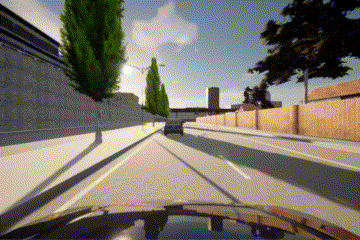
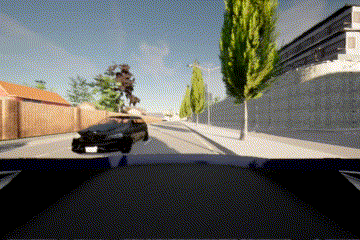
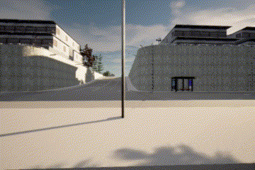
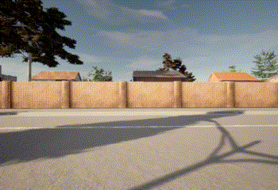

# RoAD Simulator (road-sim)

## Overview

The **RoAD** project is about **R**esponsible **A**V **D**ata - ethical, legal, and societal challenges of using data from autonomous vehicles.

In the event of an accident or a 'near miss', a vehicle should log data to its Event Data Recorder (**EDR**). Ideally, this should include:

- Data before the event (typically 5 seconds)
- Data after the event (typically 2 seconds)
- Vehicle state (acceleration, braking, steering, etc.)
- Autonomous sensor data, e.g.:
  - Camera images
  - LiDAR point clouds
- Perception data

The purpose of this project is to provide such data to explore its usefulness and inform discussion.

This is being done with the use of simulators such as CARLA.

### Manually driving in CARLA:

### Camera data saved in the EDR (front, rear, left, right):

   

### Scene reconstruction from EDR data:

## Dependencies

Python package dependencies:

- carla
- json
- numpy
- open3d
- pygame
- transforms3d

## Structure

The project has a package for each simulator (i.e. `carlasim`) and a shared `edr` package for the generic Event Data Recorder.

    road-sim/
    ├── apps/
    ├── carlasim/
    │   ├── control/
    │   ├── core/
    │   ├── edrsensors/
    │   ├── scenarios/
    │   ├── sensors/
    │   └── utilities/
    ├── docs/
    └── edr/

### Applications

The `apps` package contains Python application programs and shell scripts for this project ([see below](#applications-and-scripts)).

### Scenarios

Any Python programs in `carlasim/scenarios/` activate various scenarios in CARLA. They basically spawn specific actors at specific locations then start them moving (if appropriate).

However, they're now mostly redundant with the newer data-driven scenarios provided by JSON files in the same folder.

## Applications and Scripts

- [Manual Driving, Scenarios and EDR Execution](docs/MANUAL_DRIVING.md)
- [Fixing Detections](docs/FIX_DETECTIONS.md)
- [Manipulating Ground-Truth Perception](docs/MANIPULATE_PERCEPTION.md)
- [Generating Scene Reconstructions](docs/SCENE_RECONSTRUCTION.md)
- [Viewing Spawn Points](docs/SPAWN_POINTS.md)
- [Plotting VRU Hotspots](docs/PLOT_HOTSPOTS.md)
- [Making Videos](docs/MAKE_VIDEOS.md)
- [Batch Processing](docs/BATCH_PROCESSING.md)
