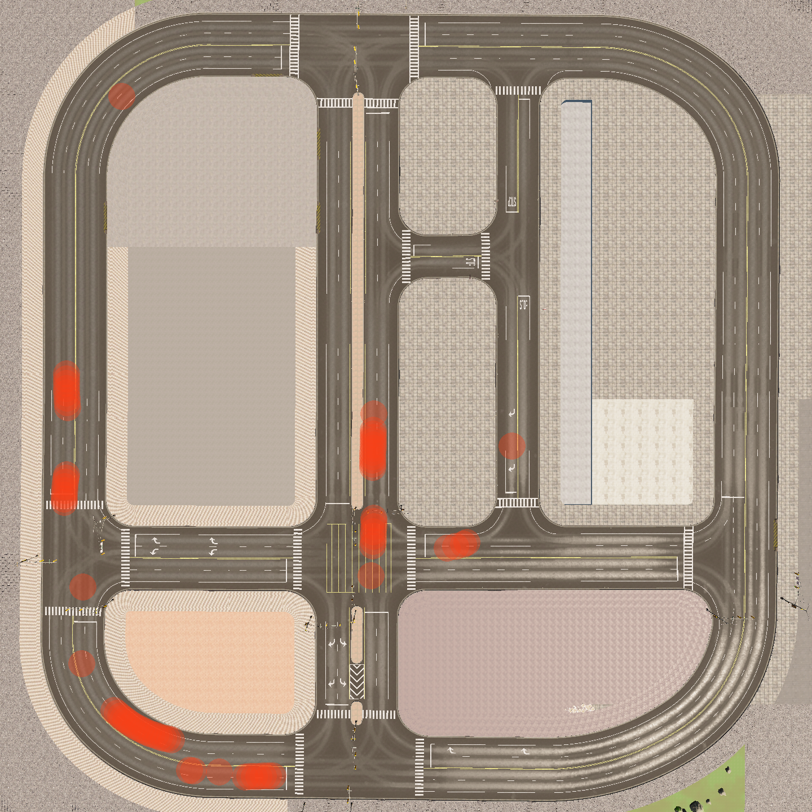

# Plotting VRU Hotspots

Given a Vulnerable Road User (VRU) hotspot log file, this program can produce a top-down view of the map (town) showing just the road network with all of the hotspots plotted.

### Command Line

    cd ~/code/road/road-sim/apps
    python3 plot_hotspots.py --input <log-file> [--output <image-file>]

If the `--output` image file parameter is given, the application will exit as soon as it has been produced. Otherwise, it will enter interactive mode. Press Escape to exit.

### Parameters

For particular maps, you may need to experiment with the `--camera` parameter to get the best view. Other parameters can be adjusted to tweak the way the hotspots are plotted.

- 
- 