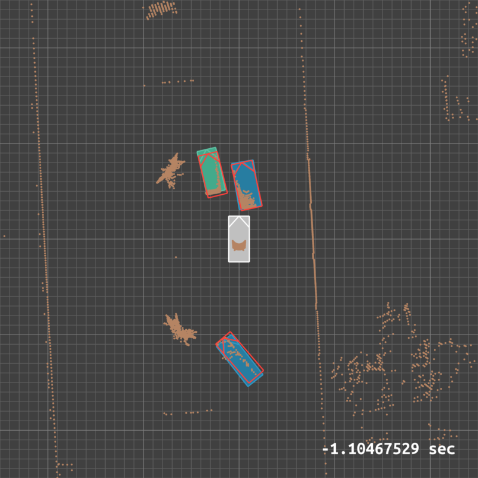

# Generating Scene Reconstructions

## Overview

Using the perception data and the closest 3D LiDAR scan, a representation of the scene can be recreated at any of the time points.

By stripping out scan points in the ground plane, we can produce a useful top-down image showing surrounding features and detected objects:

## Basic Usage

To generate a sequence of top-down images of the scene from the LiDAR and perception log outputs, use `perception_json2png`. It can be used to generate from an entire folder of logs or just a single file (for testing parameters):

    cd ~/code/road/road-sim/apps
    python3 perception_json2png.py --input <path-to-input-log(s)> --output <path-to-output-image(s)>

There are options for including LiDAR (from the closest matching timestamp), velocity vectors, ground-truth bounding box overlays, etc.

    python3 perception_json2png.py --help

## Convenience Script

Because it can be tricky and tedious to get all the parameters right, there's a convenient shell script which will create the images in a sibling `reconstruction` folder using a 'standard' EDR data location:

    ./reconstruct.sh <date-time-folder> [<variant> [<gt>] [<other-options>]]

The input folder will be a variant of:

    ~/data/edr/<date-time-folder>/perception/logs/

The output folder will be a variant of:

    ~/data/edr/<date-time-folder>/perception/reconstruction/

### Examples

    # Example 1: Reconstruct basic ground-truth output
    ./reconstruct.sh 2021-10-12-17-18-22
    
    # Example 2: Reconstruct variant 1 output
    ./reconstruct.sh 2021-10-12-17-18-22 1
    
    # Example 3: Reconstruct variant 1 with ground-truth overlays
    ./reconstruct.sh 2021-10-12-17-18-22 1 gt
    
    # Example 4: Reconstruct variant 3 with variant 1 as ground-truth overlays
    ./reconstruct.sh 2021-10-12-17-18-22 3 1
    
    # Example 3: Reconstruct variant 1 with velocity vectors
    # (note that the ground-truth parameter is explicitly empty "")
    ./reconstruct.sh 2021-10-12-17-18-22 1 "" -v

## Reconstruction Videos

See the [Making Videos](./MAKE_VIDEOS.md) documentation to see how to turn a sequence of reconstruction images into an MP4 video.

There's a convenience script to help with parameters:

    ./makereconvideo.sh <date-time-folder> <fps> [<variant> [<ground-truth>]]

For example:

    ./makereconvideo.sh 2021-10-12-17-18-22 16

